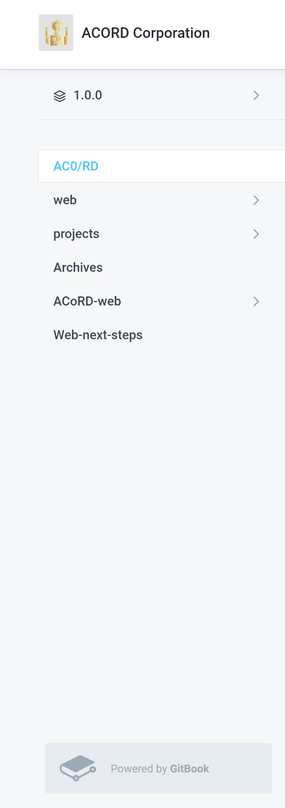
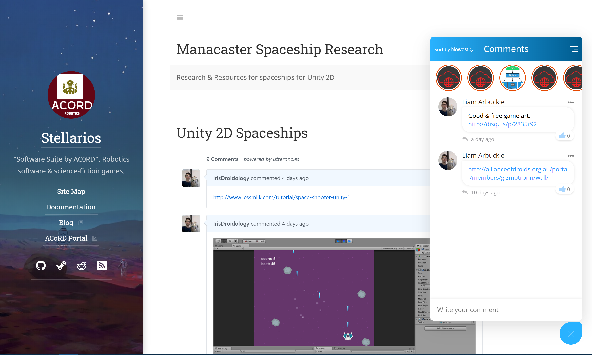
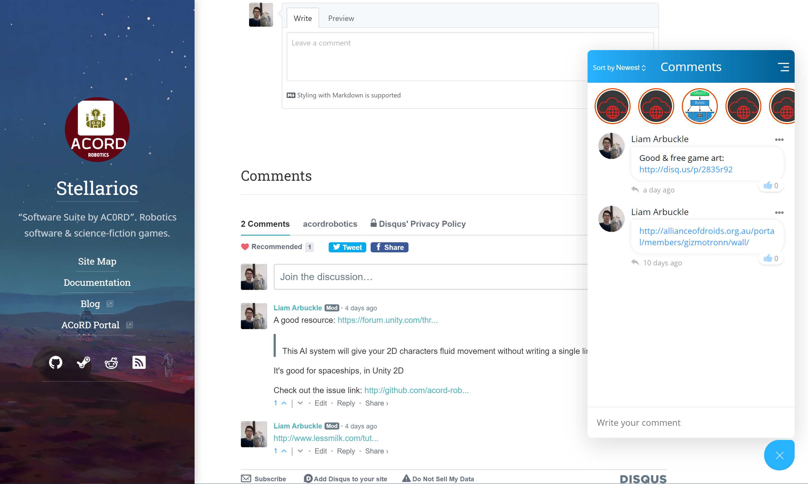
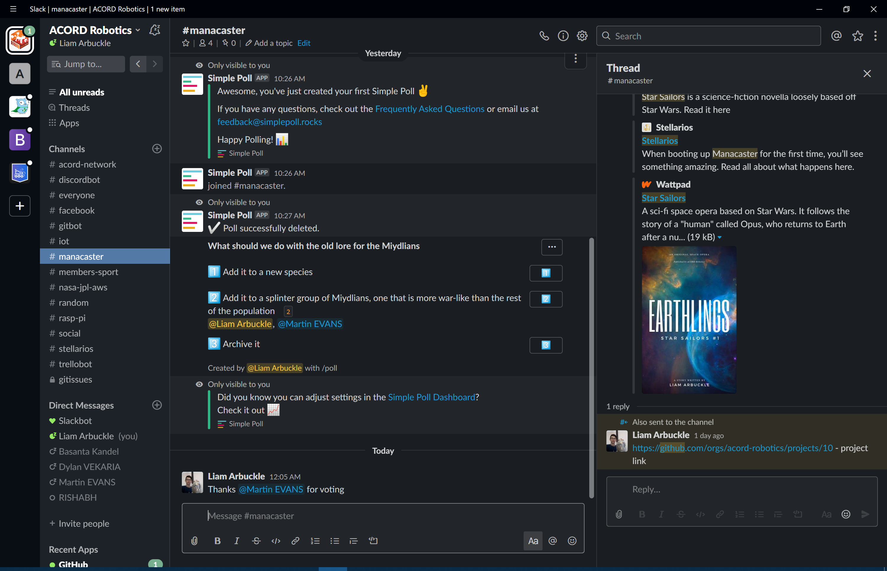

# AC0/RD

ACORD Robotics is a software, scientific engineering and writing organisation that is based and was founded in Australia by Nicholas Antipas \(COO\) & Liam Arbuckle \(Chairman\), originally under the name Alliance of Droids. We create and contribute to open-source software that is used in scientific projects like the Open Source Rover by NASA's Jet Propulsion Laboratory.

> Join a team full of talented individuals from around the globe. Chat, code, write, consume, repeat.

## Using this knowledge base

Everything that you need to know during your time as an AC0/RD member can be found here. This includes the project history, rules when committing to repositories on Github, how the network works and where to find certain things. Something important to remember is that the documentation for our _projects_ is located elsewhere, on the project page. 

### Project Documentation

The main documentation - where you're on right now - is labelled "1.0.0" and is at the top of the sidebar. To view documentation specific to a project, you can just click the button to navigate to the other projects. Project documentation is also available on the external project website. When brainstorming, logging and creating commits, we use the project _website_ for this purpose.  

## News & Media

We publish blog posts consistently on our main blog, http://blog.acord.software:

These are shared to our Facebook, Twitter, & Instagram profiles. We use Canva to create the cover images and Disqus for commenting. 

## Our Online Presence

We're visible on the main social media platforms, including Facebook, Twitter, Instagram, YouTube and Tumblr. We also have profiles on version management services like Github & Gitlab. Our username is @ACORDRobotics

## Community website

Our original website \(built with Wordpress\) was retired in January 2020, however we're still just as committed to ensuring that all of our services are integrated and that we have a fun & easy to use community section of our website.

The goal of this major project is to have a community website, with user profiles, a forum, groups and file sharing \(among other things - check out the great [Buddypress](http://buddypress.org) plugin\) that we can use for co-ordination of our projects, sharing & brainstorming ideas, and just communicating. We also want Github integrations with our website so that we can contribute from anywhere.

There's some great articles we've written on the blog about our goal:

* [Contributing code through discussion](https://blog.acord.software/post/612260427615928320/contributing-code-through-discussion) by L.Arbuckle
* [Our Network Ambitions](https://blog.acord.software/post/611947364722360320/ac0rd-digest-our-network-ambitions) by L.Arbuckle
* [HTML Dashboards for administration](https://blog.acord.software/post/611809431430283264/html-dashboards-for-administration) by L.Arbuckle
* [Constructing social networks](https://blog.acord.software/post/611414544827432960/constructing-a-social-network) by L.Arbuckle

### Current status

On the Stellarios documentation, we have a combination of Disqus, JointComments & Utteranc.es to provoke user discussion, collaboration & development. Link: [http://acord.software/stellarios/manacaster-spaceship/](http://acord.software/stellarios/manacaster-spaceship/)

We're also using a combination of Flarum \(forums\), Wordpress \(Gamificiation & integration with our software\), and Tribe.so \(internal social network\). Disqus is one of the methods we use to integrate all of these services into our network. 

#### Build Issues

For any issues with the [bootstrap site](http://github.com/acord-robotics/acord-robotics.github.io) building with the github pages service, consult the "settings" tab of the repository. Email an administrator if this tab is not visible for you.

Administrators:

* Liam Arbuckle: liam@acord.software & gizmotronn@acord.software
* Rishabh Chakrabanty
* Basanta Kandel

You can also message us on the chat service on the website, which is an upcoming feature \(see below\).

### Upcoming Features & Projects

* Chat function - also available in-app
* Progressive web app
* HTML Cards - assigned to Basanta
* Open Source Social Network
* Video tutorial library
* Django games library
* Single Sign On

### Forums

The community forums are made up of the following software: 

* Jointcomments
* Disqus
* Utteranc.es
* BBPress & phpBB
* Jekyll
* Bootstrap
* Wordpress
* Buddypress
* Flarum
* MyArcadePlugin
* Slack
* Stack Exchange

 The forum threads are created on Jekyll, however for a list of upcoming threads that haven't been published yet, go to [this thread](http://acord.software/stellarios/threads).

## Ideas 

All of our thoughts and ideas are commonly sent on the JointComments plugin, or in slack at http://acordrobotics.slack.com

## Current Projects



> "Earth's last video game"

Manacaster \(dev name, actual name is Star Sailors: Ansible\) is a 2D RPG programmed in Unity and created by AC0/RD. 

### Timeline

* Started: July 2019
* Status: open \(as of March 2020\)

### Project Information

* Project maintainers: D.Vekaria, L.Arbuckle, M.Evans
* Repository: Github/Acord-Robotics/Manacaster
* Cost: none
* Type: game
* Software: Unity Game Engine



## Timeline

* Started: April 2020

## Information

* Project type: library \(collection of software\)
* Software used: Django \(Python\), Unity \(Games\), Javascript, Pygame
* Cost: none 
* Project maintainers: L.Arbuckle, D.Musovic
* Repositories: Gizmotronn/Space-Attackers, Gizmotronn/Django-Games

This project started off as something for me to do to improve my knowledge of Python, however over the last few weeks I've been thinking about how else I can use it. I'm going to be inserting it into my Computer Science assessment at school and once we get a single-sign-on system set up for AC0/RD, it will also serve as a games library that users can play on our site. These don't just have to be on a Django site, but pygame will work well with Django as well.



### Timeline

* Started: 2016
* Status: open \(as of March 2020\)

### Project Information

* Project maintainer: L.Arbuckle
* Type: internet
* Software: wordpress, raspbian, reddit, bootstrap
* Repository: Github/Acord-Robotics/Portal
* Cost: none \(as of March 2020\) \(originally covered by Mindbuzz.com.au\)



## Archived Projects


These projects are "archived", or read-only, however they are all still viewable on our Github page and we're happy to re-open any projects that you're interested in improving




## Timeline

* Started: August 2016
* Finished: January 2020

### Information

* Project type: website
* Software used: wordpress \(self-hosted\)
* Cost: none \(sponsored by Mindbuzz.com.au\)
* Project maintainers: L.Arbuckle, S.Firth
* Repository Link: Github/Acord-Robotics/Portal/tree/Portal



## Timeline

* Started: 2018
* Closed: 2019

### Information

* Software: Rainmeter
* Cost: none
* Project maintainers: L.Arbuckle

### Status

This project is currently archived as we prepare to work on other projects like Manacaster, however it is by no means closed forever.



### Timeline

* Started: December 2019
* Finished: March 2020

### Information

* Members: R.Chakrabanty, L.Arbuckle, E.Montgomery, M.Asavkin
* Project maintainer: R.Chakrabanty
* Software: AWS, Linux Ubuntu, Gazebo
* Cost: $500
* Repository: Github/Exynos-999/AWS\_JPL\_OSR\_DRL



## To-Do List

This section is just for general things that our members have to do, for example writing a new blog post or fixing a broken link. For larger "to-dos", like creating a new feature on the website \(e.g. HTML cards\), create a new section on the project's documentation page.

* Write new blog post about Gitbook
* Create cover image & instagram images for above blog post
* Fix error on [readme](http://github.com/acord-robotics/acord-robotics.github.io/blob/master/readme.md) - liquid
* Send message in slack about Gitbook & the alternative solutions
* Update Project \#10 on Github - March 2020
* UROP - Rishabh Chakrabanty
* Organise meeting with applicants on Facebook
* Categorize slack plugin archives!
* Create single sign on solution
* Fix bootstrap site on large monitors

* [Name.com Gsuite](https://www.name.com/gsuite)

