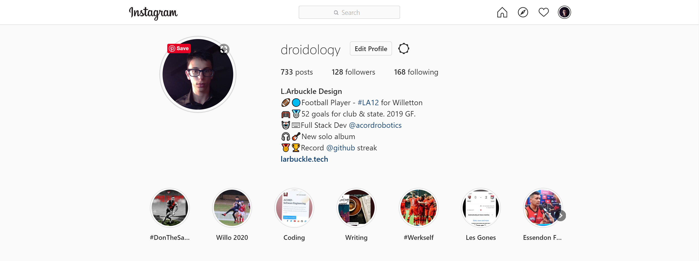

# March 2020 Docs

### Rules regarding social media

The following people currently have access to our social media profiles:

* Nicholas Antipas
* Liam Arbuckle \(Chairman\)
* Dylan Crowe \(CEO\)
* Rishabh Chakrabanty

You're free to tag @ACORDRobotics in your user profile on social media:

You're also free to post about us on social media in the following circumstances:

* You write a post on our blog
* You contribute to one of our projects
* You are the receipient of a reward/award while working with us

Members are also free to gain access to our social media profiles if they write on our blog a lot, as getting our posts out to the public via Facebook & Twitter is incredibly important to our growth as a brand & as an identity.

